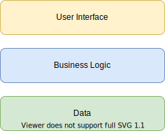

# Swift architecture

This document describes my architecture of choice for iOS development using Swift.

# Layers

I generally split my architecture into three different layers. The `User Interface` layer, the `Business logic` layer and the `Data` layer.

